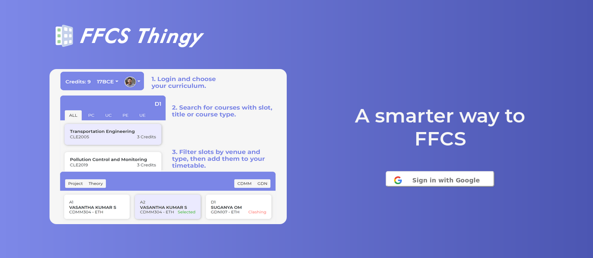
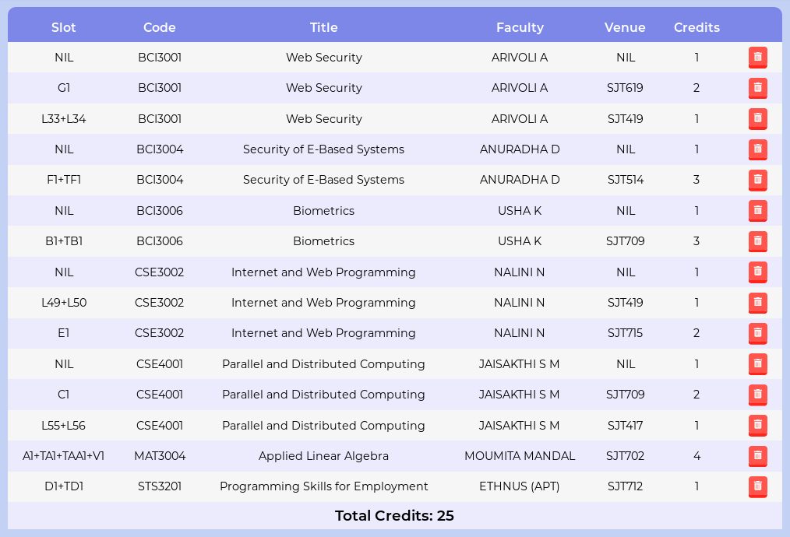

# FFCSThingy2.0



## Extension:
### https://github.com/namsnath/ffcs.ooo-scraper-extension
- Basic UI with a Google Sign-In Button
- Vtop login button after Google Sign-In
- After VTOP login, data is scraped and saved (Backend)

## Frontend:
### Last Year: https://github.com/palashgo/FFCSThingyFrontend
- Google Login. VTOP Login optional for smart features (Needs extension)
- Courses displayed under UE, PE, PC, UC, other, all
- You select one of these, it shows you a list of courses
- You click a course, it shows you available slots
- Can filter these by slot and venue
- Click one of the slots, it gets added. 
- if there's a clash, show appropriate error on the card and don't allow adding

- Update timetable and course list + credits accordingly
- Multiple timetables ka feature. Choose which timetable to edit and work on



- Integration with Palash's timetable generator (this isn't very tough)
- Hover over timetable for details
- Color coding per subject for easy readability


## Backend:
### Last Year: https://github.com/namsnath/FFCSThingy
- Google Auth
- Sessions
- VTOP Scraping from Extension data
- Course add/delete
- Multiple Timetables
- Heatmaps/Popularity
- Credit calculation from parsed data
- TTGen


## Setting Up:
- Install Node, Mongo
- Run ```mongod``` in a terminal somewhere (Not required if it's running as a service)
- In root, run ```npm i```
- ```npm i -g express nodemon concurrently babel-cli```
- In client, run ```npm i```
- In root, run ```npm run start:server```
- Navigate to: 
	-  ```http://localhost:3001/course/addCoursesToDB```    
    -  ```http://localhost:3001/curriculum/updateCurriculums```
- ```Ctrl+C``` out of the npm run command
- ```npm run start:dev```  and you'll be up and running   
